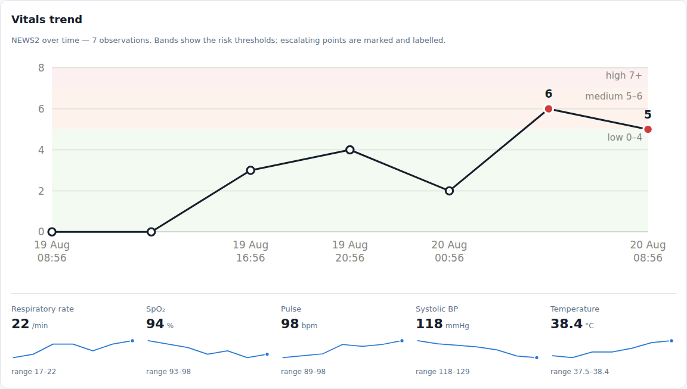

# Patient Ward Monitor

Scan a ward's case sheets, get **one case record per patient**, then monitor those
patients with NEWS2 early-warning scoring.

Upload a photo or a multi-page PDF of the ward folder. Claude reads each sheet,
splits the document by patient, and creates a separate case record for every
person it finds — matching against patients already on the ward so a re-scan
updates their record instead of duplicating them.




---

## Quick start

```bash
python -m venv .venv && source .venv/bin/activate
pip install -r requirements.txt

cp .env.example .env          # add your ANTHROPIC_API_KEY
export ANTHROPIC_API_KEY=sk-ant-...

# Bootstrap the first account (prompts for a password):
python -m scripts.create_user --username admin --name "Ward Admin" --role admin

python -m scripts.seed_demo   # optional: a demo ward, 6 patients and 4 staff accounts
uvicorn app.main:app --reload
```

Open <http://127.0.0.1:8000/> and sign in. `/docs` has the API.

The demo seed creates `admin`, `siyer` (doctor), `mthomas` (nurse) and `clerk`,
all with the password `ward-demo-password` — for looking around locally, never
for anything real.

Without an API key the app still runs — scans are stored and records can be
created by hand — but automatic extraction is disabled and says so.

---

## How intake works

```
scan (PDF / image)
      │
      ▼
  Claude Opus 5 vision  ──►  CaseSheetBatch { sheets: [ per-patient data + page range ] }
      │
      ▼
  identity match  ──►  MRN  ──►  name + DOB  ──►  name + age  ──►  new patient
      │
      ▼
  one CaseRecord per sheet, status = UNVERIFIED
      │
      ▼
  clinician verifies against the original scan
```

**One sheet, one record.** A 40-page PDF holding 20 patients produces 20 case
records, each tagged with the pages it was read from (`source_pages`) so any
field can be traced back to the paper.

**Identity matching, strongest signal first.** Hospital number is authoritative.
Falling back to name + DOB is treated as reliable; a name-only or name + age
match still links the record but raises a warning asking staff to confirm it is
the same person. Same name with a *different* recorded DOB is treated as a
different person — never merged.

**Same patient, same admission → update, not duplicate.** A second sheet for
someone already on the board updates their open episode. A sheet with a
different admission date starts a new case record, so readmissions stay separate.

### The safety rules that shape the code

Automatic transcription of handwriting is useful and it is also how a wrong drug
dose gets into a chart. The pipeline is deliberately conservative:

| Rule | Where |
|---|---|
| Illegible fields are left `null` and named in `unreadable_fields` — never guessed | `extraction.py` (prompt) |
| Every auto-created record starts `unverified` and is listed in the review queue | `intake.apply_sheet` |
| A scan never overwrites clinical data a clinician has already **verified** — conflicts are flagged for manual reconciliation | `intake._apply_clinical` |
| Existing demographics are only gap-filled, never clobbered by a blank field | `intake._fill_patient_blanks` |
| A sheet with no name *and* no MRN is skipped, not filed under a guess | `intake.apply_sheet` |
| Confidence below 50% raises a warning on the record | `intake._sheet_warnings` |
| Medication entries with no readable drug name are dropped rather than invented | `intake._medications` |
| "None known" in the allergy box is shown but not rendered as a red allergy flag | `services.real_allergies` |
| A NEWS2 score computed from incomplete vitals is labelled *partial* — it can only be an underestimate | `scoring.calculate_news2` |

---

## Who can do what

Every page and endpoint requires a signed-in user. Browsers use a signed session
cookie; devices and integrations send `Authorization: Bearer <token>`, where only
a SHA-256 of the token is stored.

| | view | upload | record obs | verify | edit | discharge | ack alerts | manage users |
|---|:-:|:-:|:-:|:-:|:-:|:-:|:-:|:-:|
| **admin** | ● | ● | ● | ● | ● | ● | ● | ● |
| **doctor** | ● | ● | ● | ● | ● | ● | ● | |
| **nurse** | ● | ● | ● | ● | | | ● | |
| **clerk** | ● | ● | | | | | | |
| **readonly** | ● | | | | | | | |

Nurses may confirm a transcription against the sheet, because that is a
transcription check rather than a clinical decision; changing a diagnosis or
discharging a patient stays with doctors. Clerks scan paperwork and read the
board without clinical authority.

Two rules make the audit trail mean something:

- **Actions are attributed to the session, never to a typed-in name.** The API
  rejects a `recorded_by` field outright — an observation cannot be filed under
  a colleague's name.
- **The UI hides what your role cannot do**, so nobody is offered a button that
  would only 403.

Passwords are hashed with scrypt at the RFC 7914 interactive parameters
(n=2¹⁴, ~160 ms per attempt). Five failed attempts lock an account for five
minutes. Deactivating a user revokes their sessions and API token immediately.

---

## Monitoring

Each set of vitals is scored with **NEWS2** (Royal College of Physicians): RR,
SpO₂ (scales 1 and 2), supplemental oxygen, systolic BP, pulse, temperature and
ACVPU consciousness. The score drives the ward board ordering (sickest first),
the escalation text, and the alert feed.

| Score | Risk | Response |
|---|---|---|
| 0 | Low | Routine observations, minimum 12-hourly |
| 1–4 | Low | Minimum 4–6 hourly |
| Any single parameter = 3 | Low–medium | Urgent review by a competent clinician; hourly obs |
| 5–6 | Medium | Urgent review by a ward doctor; hourly obs |
| ≥ 7 | High | Emergency assessment by a critical care capable team |

Vitals printed on the case sheet are transcribed as the first observation, so a
patient has a score the moment their record is created.

### The trend chart

Each case page plots NEWS2 over time, with a small multiple per measure. It is
inline SVG rendered on the server — no charting library and no CDN, so it works
on a slow ward network and needs nothing added to a hospital CSP.

Three deliberate choices:

- **Risk lives in the labelled background bands, not in four marker colours.**
  The four NEWS2 risk hues cannot all be told apart as small marks on a white
  card — two of them measure ΔE 13.6 apart and sit under 3:1 contrast. So the
  bands carry risk, each labelled in words, and only escalating points take an
  accent colour *and* print their score. Colour never carries meaning alone.
- **One y-axis per chart.** The vitals are separate small multiples rather than
  extra lines on the NEWS2 axis; overlaying different units on one scale invents
  correlations that are not in the data.
- **x is real elapsed time**, so a six-hour gap between rounds looks like one.

Every plotted value also appears in the observation table below the chart, so no
reading is reachable only by hovering.

---

## API

Interactive docs at `/docs`. Everything the UI does is available as JSON.

| Method | Path | Purpose |
|---|---|---|
| `POST` | `/api/uploads` | Upload scans; returns per-sheet outcomes |
| `POST` | `/api/uploads/{id}/reprocess` | Re-run extraction on a stored scan |
| `GET` | `/api/uploads` · `/api/uploads/{id}` | Upload history and status |
| `GET` | `/api/board` | Ward board, sickest first |
| `GET` | `/api/cases` | Filter by `status`, `ward`, `verification` |
| `POST` | `/api/cases` | Create a record by hand (illegible scan) |
| `GET`/`PATCH` | `/api/cases/{id}` | Read / correct a record |
| `POST` | `/api/cases/{id}/verify` | Confirm against the original scan |
| `POST`/`GET` | `/api/cases/{id}/observations` | Record and list vitals |
| `GET` | `/api/patients?q=` | Search by name or MRN |
| `GET` | `/api/alerts` · `POST /api/alerts/{id}/acknowledge` | Alert feed |
| `GET` | `/api/me` | The caller's identity and permissions |
| `GET`/`POST` | `/api/users` | List / create staff accounts (admin) |
| `POST` | `/api/users/{id}/deactivate` | Revoke access immediately (admin) |

Example:

```bash
curl -X POST http://127.0.0.1:8000/api/uploads \
  -H "Authorization: Bearer $WARD_TOKEN" \
  -F "files=@ward-round.pdf"
```

```json
[{
  "upload": {"status": "completed", "sheets_detected": 3, "records_created": 3},
  "outcomes": [
    {"action": "created", "case_number": "CR-2026-00001", "patient_name": "Asha Rao",
     "page_range": "1", "confidence": 0.94, "warnings": []},
    {"action": "updated", "case_number": "CR-2026-00002", "patient_name": "Bilal Khan",
     "page_range": "2-3", "confidence": 0.71,
     "warnings": ["Illegible on the scan: oxygen flow rate"]}
  ]
}]
```

---

## Configuration

All settings take a `WARD_` prefix and can live in `.env` (see `.env.example`).

| Variable | Default | Meaning |
|---|---|---|
| `ANTHROPIC_API_KEY` | — | Enables automatic extraction (no prefix) |
| `WARD_DATABASE_URL` | `sqlite:///./ward.db` | Any SQLAlchemy URL |
| `WARD_UPLOAD_DIR` | `./uploads` | Where scans are stored |
| `WARD_EXTRACTION_MODEL` | `claude-opus-5` | Model used to read sheets |
| `WARD_MAX_UPLOAD_MB` | `25` | Per-file upload limit |
| `WARD_SECRET_KEY` | random | Signs session cookies — **set this in production**, or every restart signs everyone out |
| `WARD_SESSION_MAX_AGE` | `28800` | Session lifetime in seconds (one shift) |
| `WARD_COOKIE_SECURE` | `false` | Set `true` behind HTTPS |

Accepted uploads: PDF, PNG, JPEG, WebP, GIF, TIFF, BMP. Images are downscaled to
1568px on the long edge and converted if needed; PDFs are sent whole so Claude
can follow a patient across continuation pages.

---

## Layout

```
app/
  main.py          FastAPI app
  config.py        settings
  db.py            engine and session
  models.py        User, Patient, CaseRecord, Upload, Observation, Alert, Ward, Bed
  auth.py          password hashing, sessions, bearer tokens, the role matrix
  extraction.py    Claude vision/PDF → structured sheets (pluggable backend)
  intake.py        identity matching, record creation, safety rules
  scoring.py       NEWS2
  charts.py        server-rendered inline SVG for the vitals trend
  services.py      queries shared by API and UI
  routers/         api.py (JSON) · ui.py (HTML)
  templates/       login, board, upload, review, case, users
scripts/           seed_demo.py · create_user.py
tests/             194 tests
```

`extraction.set_extractor()` swaps the backend, which is how the tests run the
whole pipeline without touching the API.

---

## Tests

```bash
pytest -q      # 194 tests
```

Covers the NEWS2 chart parameter by parameter, identity matching and
de-duplication, the no-overwrite rules, alert escalation, the full role matrix
against real endpoints, login and lockout behaviour, chart geometry and its
legibility rules, and the HTTP layer end to end.

---

## Before using this with real patients

This is a working application, not a deployed hospital system. It deliberately
does **not** yet include:

- **Single-sign-on, MFA, or password rotation.** Accounts are local to the app,
  with role-based access and scrypt-hashed passwords, but a hospital will want
  this behind its own identity provider. The login throttle is also in-process,
  so it does not hold across multiple workers.
- **Encryption at rest and PHI handling.** Scans sit unencrypted in
  `WARD_UPLOAD_DIR` and data in SQLite. Real deployment needs encrypted storage,
  retention limits, and a decision about what leaves the building — case sheets
  are sent to the Claude API for extraction, which is a data-processing
  arrangement your organisation must approve.
- **A tamper-evident audit trail.** Who verified, who recorded and who
  acknowledged are all captured against a user account, but edits are not
  versioned and the log is not append-only.
- **Regulatory clearance.** NEWS2 scoring and automated transcription in a
  clinical workflow may bring this under medical-device software rules in your
  jurisdiction (UKCA/CE under MDR, FDA CDS guidance, CDSCO, etc.).

> **Clinical decision support only.** Auto-extracted records are created
> unverified and must be checked against the original sheet by a clinician.
> NEWS2 scores assist ward staff; they do not replace clinical judgement.
